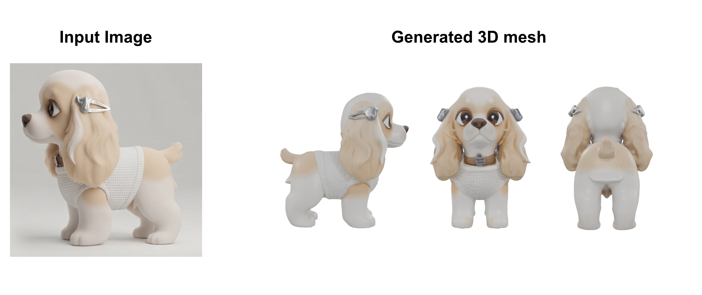
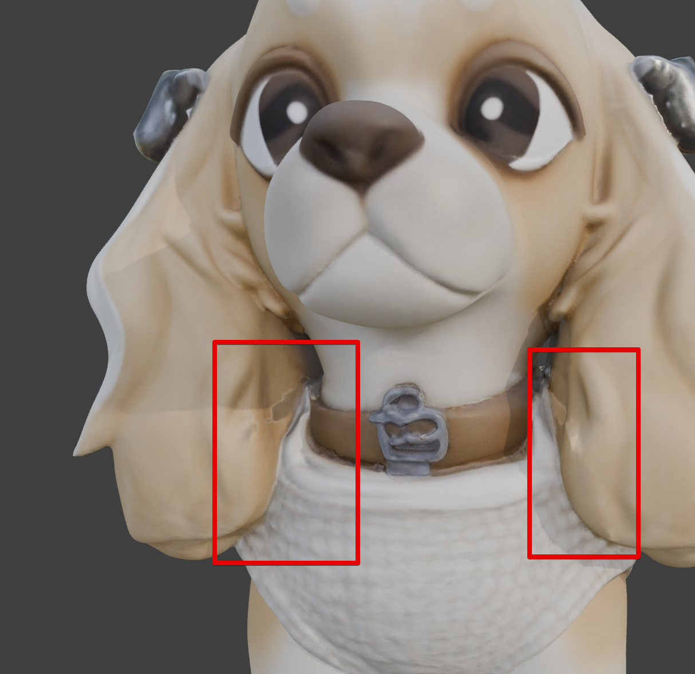
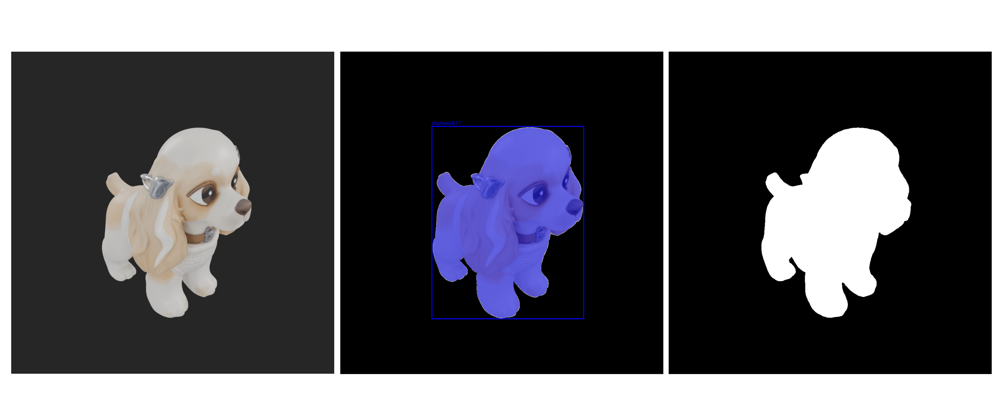
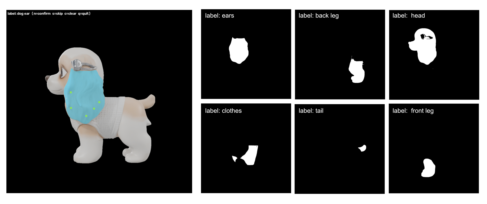

# Image2model — lab notebook

**Project goal:** take a photo of a dog → generate a stylized (in-house game style) 3D character of it → usable in-game as an animated character.

Core requirement driving everything below: the output mesh needs clean, animatable part separation (head, ears, legs, paws, tail, clothing) — not just a single fused blob.

---

## Approach 1 — photo → generative mesh → auto-segment the result

### Pipeline as designed

1. Use Gemini to generate 3 stylized cartoon-style reference views from a photo of the dog.
2. Feed those into Meshy AI to generate a 3D mesh.
   - Note: free plan only exports Meshy 5 models. Meshy 5 output has no part segmentation and messy/non-manifold topology.

   
   *Meshy 5 output — stylized dog mesh, no part segmentation.*

   

   *Close-up on the ear/front-paw intersection that motivated the segmentation work below.*
3. Built a Blender script (`turntable_render.py`) to auto-render the generated mesh from many camera angles (elevation rings × azimuth steps), saving camera intrinsics (K) + extrinsics per view as JSON — intended as input for a segmentation-and-back-projection step.
   - Added a studio 3-point light rig (key/fill/rim) + flat world-ambient fill after initial renders came out too dark/harsh.
4. Attempted automatic part labeling with open-vocabulary detection + SAM:
   - First tried Grounded-SAM (Grounding DINO + MobileSAM). Grounding DINO's custom CUDA op has no MPS support on Apple Silicon → falls back to slow CPU. Considered acceptable for a one-time offline batch, but then hit a bigger problem (see 4.1).
   - Switched to YOLO-World + MobileSAM instead, for full MPS pipeline on the M1 MacBook Pro (2020, not 2019 — flagged and corrected mid-project).
   - Prompts used:
     ```
     PROMPTS = [
         "dog head",
         "dog ear",
         "dog leg",
         "dog paw",
         "dog tail",
         "sweater",
     ]
     ```

### Problem 4.1 — text-prompted detection fails on stylized geometry

**Result:** out of 32 turntable captures, only 2 produced any detection at all, and both mislabeled the *entire model* as "head."


*One of the 2 successful detections — box + mask cover the whole model, labeled "head."*

**Diagnosis:** YOLO-World / Grounding DINO are trained almost exclusively on real photographs. Stylized, toon-shaded, low-poly geometry has none of the texture/shading cues these detectors key off of — no strong "ear," "leg," or "head" features to recognize. The detector falls back to its most confident large box, which is the whole silhouette.

**Lesson:** text-prompted open-vocabulary detection is not reliable for stylized/non-photoreal 3D renders. Domain gap, not a tuning problem — lowering confidence thresholds or rewording prompts wasn't expected to fix it.

### Attempt to solve Problem 4.1 — replace detection with manual point-click + SAM

Kept SAM (mask quality doesn't depend on the model recognizing "dogness," just on responding to edges/regions — holds up fine on stylized shapes). Removed YOLO-World's text-prompted box step, replaced with an interactive click tool (`segment_parts_interactive_v2.py`): left-click = positive point, right-click = negative point, per label per view, live mask preview via MobileSAM, output format kept identical to the old YOLO-World script so downstream steps didn't need to change.

**Result:** produces better quality segmentation than in first version. But takes a lot of time for manual labeling (i.e. 32 images x 6 labels) and requires manual clean up of geometry.


*Manual point-click + MobileSAM result — correctly separated masks per part, compare to the head-only failure above.*

**Status at time of writing:** functional, semi-manual segmentation working, but too labor-intensive to be the long-term path (see time-cost finding above). Downstream steps designed but not yet run:
- `render_face_ids.py` — re-renders each saved camera view with faces color-coded by index (anti-aliasing/denoising disabled) so 2D masks can be mapped to specific mesh faces without ray-casting.
- `fuse_labels.py` — decodes face-ID maps, cross-references against clicked masks across all views, majority-votes a label per face.
- `apply_labels_and_separate.py` — turns fused per-face labels into vertex groups, optionally separates mesh into per-part objects (`Dog_head`, `Dog_ear`, etc. + leftover `Dog_body`).

**Known unresolved limitation:** none of this fixes the actual problem that motivated it — intersecting geometry (ears modeled like long hair, clipping through the front paws). Segmentation tells you *which faces belong to which part*; it does not move geometry apart. That remains a manual mesh-editing step even after automated part separation.

---

## Approach 2 — considered but not pursued: AI mesh-segmentation-as-a-service

Investigated whether dedicated tools could replace the custom SAM pipeline entirely:

- **3D AI Studio Segmentation Tool**, **Hyper3D OmniCraft**, **Neural4D Direct3D-S2** — all take a single-mesh GLB and auto-split it into logical parts (limbs, clothing, etc.) in ~1–2 minutes, no manual clicking required.
- **Meshy 6** (Jan 2026 release) — major topology quality jump over Meshy 5 (watertight, cleaner geometry), includes auto-rigging with 500+ animation presets. Caveat found in review sources: auto-rig reportedly still fails on "chunky cartoon proportions" — a real risk given our stylized, non-realistic dog style.
- **Meshy Auto Split** — designed for 3D-printing part separation (cuts along natural boundaries, auto-caps watertight), not semantic rigging segmentation — different goal, noted but not the fit here.

**Same fundamental limitation as Approach 1:** none of these tools resolve physically intersecting/overlapping geometry — they cut boundaries between parts, they don't reposition vertices. Regenerating through Meshy 6 instead of 5 might reduce how bad the intersection is at the source, but doesn't eliminate needing eyes on the result.

**Decision:** deprioritized in favor of Approach 3 below, which sidesteps the intersection problem structurally rather than needing to detect-and-fix it after the fact.

---

## Approach 3 — modular hand-authored parts assembled by breed detection (current direction)

### Idea

Stop generating a mesh per photo. Instead:
1. Hand-model a small library of clean, rigged, low-poly parts (body, head, ears, tail, legs/paws, coat overlay) once, in-house, in the target art style.
2. Run a breed classifier on the input photo.
3. Assemble/parametrize the pre-built parts according to the recognized breed (or blended breed probabilities, for mixed-breed pets) — "puzzle pieces," not per-photo generation.

**Why this is a stronger fit than Approaches 1–2:** full control over topology from the start (no intersection to detect or fix), guaranteed style consistency (hand-authored, not generated), no fighting a generic auto-rigger against a stylized proportion set.

### Concerns raised against this idea (and how they're addressed in the rig design)

| Concern | Resolution |
|---|---|
| Need to create all parts manually | Bounded, one-time cost: model each part once with a handful of blend-shape targets, not once per breed. The breed→parameter mapping is data curation, not modeling. |
| Dog's individual identity is lost (only generic breed shape) | Geometry comes from breed classification (generic); coat color/pattern is sampled from the photo and applied as texture on the assembled shape. Partial identity preservation via texture, not geometry. |
| Long-hair vs short-hair breeds — hard to model fur at low poly | Don't simulate hair. Treat coat length as a blendshape on a thin overlay shell (chest ruff, ear fringe, tail plume) blending from flat to puffy, paired with a stylized fuzzy-edge shader. |
| Ear shapes vary a lot (up, down, folded, etc.) — hard to parametrize | Author 3–4 blend targets *on one shared-topology ear mesh* rather than separate swappable meshes. Discrete-feeling types become continuous blend weights, so mixed breeds blend naturally instead of needing a lookup table. |
| Tails — same issue as ears | Same solution: shared-topology blend targets (straight / curled / bushy / docked), not separate meshes. |

### Rig structure (sketched)

One shared-topology skinned mesh with six part regions, each driven by blendshapes:
- **Body** — continuous sliders: length, height, chest depth
- **Head** — continuous sliders: snout length, head width
- **Legs** — continuous sliders: length, thickness
- **Ears** — discrete-feeling type blend (up / down / folded) + size, all as blend weights on one base ear mesh
- **Tail** — same pattern: type blend (straight / curled / bushy) + size
- **Coat overlay** — thin shell mesh blending short→long/fluffy silhouette

Data flow: breed classifier output (probability distribution, not hard label) → weighted blend of per-breed parameter profiles → blend-shape weight vector applied to the rig → photo-sampled color/pattern applied as texture on top → assembled character.

Breed classification itself considered a solved/off-the-shelf problem — standard approach is a classifier fine-tuned on the Stanford Dogs dataset (120 breeds), not something to build from scratch.

### Pilot experiment (planned, not yet run)

**Goal:** validate the riskiest assumption before committing to the full part library — does blending discrete-feeling ear types (up/down/folded) actually produce a coherent in-between shape at low poly, or does it turn to mush?

**Scope:** ears only, ultra-low-poly base mesh (~30–60 tris, 3–4 cross-section loops for bend), 3 shape-key blend targets:
- Target A — up/prick (e.g. German Shepherd–like)
- Target B — down/floppy (e.g. Beagle–like)
- Target C — folded/rose (e.g. Collie/Pug–like)

**Test cases:**
- 3 breeds, each pinned 100% to one target — sanity check the extremes read correctly.
- 1 deliberate 50/50 blend between A and B — the actual test. If it reads as a plausible "semi-erect" ear, low-poly blending works. If it's a broken/ambiguous silhouette, discrete swapping is needed instead of continuous blending — a cheap thing to learn now vs. after building the full part library across all six regions.

**Success criteria:** the blended shape must read as coherent at actual in-game render distance/camera angle, not just in a close-up Blender viewport — silhouette legibility at low poly is distance-dependent.

**If ears pass:** tail is very likely fine too (same fundamental risk profile). Body/head/legs are lower risk since they're naturally continuous already, not discrete-feeling.

---

## Open problems / not yet resolved

- Pilot experiment (ears, 3 breeds, blend test) not yet executed.
- Breed → blend-weight parameter table not yet authored (one-time curation task, still to do).
- Specific breed classifier model not yet selected/tested.
- Mixed-breed blending strategy (weighted average of breed profiles by classifier probability) designed conceptually, not yet implemented.
- Identity preservation via photo-sampled coat texture — approach decided, not yet implemented.
- Approach 1's segmentation pipeline (face-ID render → fuse → separate) is built but untested end-to-end; may be revisited if Approach 3 needs a segmentation step for QA/validation of hand-built parts, but is not currently the primary path.

## Scripts produced this session

- `turntable_render.py` — Blender: automated multi-angle render + camera K/extrinsics export, studio 3-point lighting rig.
- `segment_parts.py` — YOLO-World + MobileSAM automated segmentation (superseded by interactive version due to stylized-geometry failure).
- `segment_parts_interactive_v2.py` — manual point-click + MobileSAM segmentation, same output format as above.
- `render_face_ids.py` — Blender: face-ID map rendering for mask-to-face projection.
- `fuse_labels.py` — cross-view mask/face-ID fusion into per-face labels.
- `apply_labels_and_separate.py` — Blender: vertex groups + mesh separation from fused labels.
